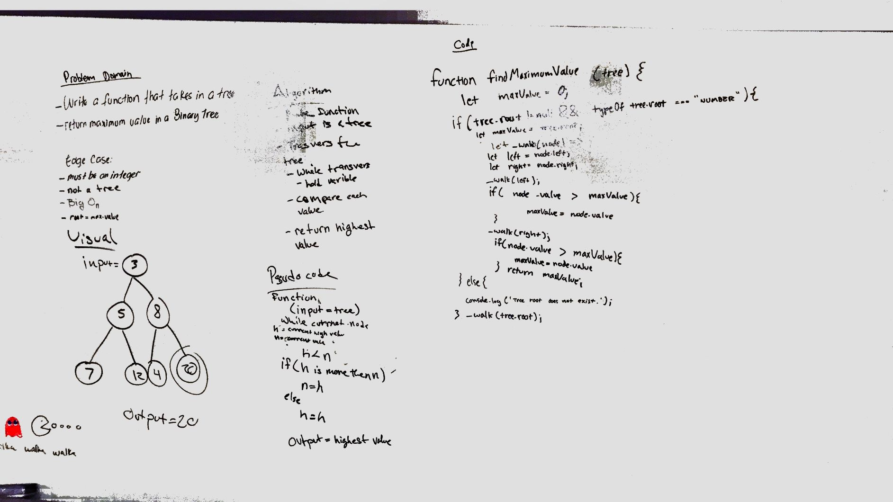

# Challenge Summary
Find the maximum value in a _binary tree_ and return the maximum value to the user.

## Challenge Description
Write a function called find-maximum-value which takes binary tree as its only input. Without utilizing any of the built-in methods available to your language, return the maximum value stored in the tree. You can assume that the values stored in the Binary Tree will be numeric.

## Approach & Efficiency
What we did was as it walked through the tree it compare the node to the a varable that hold the max value. If the node is higher then the varable then it replace the value of the varable. At the end return the high value.

## Solution
