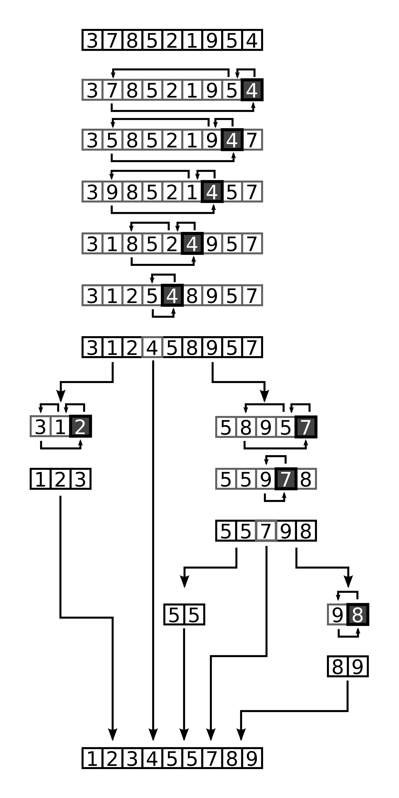

# Quick Sort

## Learning Objective
Today we will be gaining a better understanding of Quick Sort. This include what Quick Sort is and how it works.

## What is it?
Quick sort is a way to sort an array. It use what is called a pivot, which is set postion in the array and compare each value to the pivot. If it hight it gose to the right if it less it gose to the left. Onece that done it dose this be "divide and conquor" of the array. This means it breaks the array into smaller pieces and then sort, and bring it back together. As shown in the diagram below.

## Diagram 


## How dose it work?
The Quick Sort has three parts to it. The frist is the pivot which can be either the last or middle of the array, in this case the pivort is the last value of the array. Once it reach the point where it can't compare values anymore it splits the array into partitions. Then repeat the process of compareing the pivot to the rest of the array with a method called 'swap' which help swap values around. 

## PseudoCode
```
ALGORITHM QuickSort(arr, left, right)
    if left < right
        // Partition the array by setting the position of the pivot value 
        DEFINE position <-- Partition(arr, left, right)
        // Sort the left
        QuickSort(arr, left, position - 1)
        // Sort the right
        QuickSort(arr, position + 1, right)

ALGORITHM Partition(arr, left, right)
    // set a pivot value as a point of reference
    DEFINE pivot <-- arr[right]
    // create a variable to track the largest index of numbers lower than the defined pivot
    DEFINE low <-- left - 1
    for i <- left to right do
        if arr[i] <= pivot
            low++
            Swap(arr, i, low)

     // place the value of the pivot location in the middle.
     // all numbers smaller than the pivot are on the left, larger on the right. 
     Swap(arr, right, low + 1)
    // return the pivot index point
     return low + 1

ALGORITHM Swap(arr, i, low)
    DEFINE temp;
    temp <-- arr[i]
    arr[i] <-- arr[low]
    arr[low] <-- temp 


```

## Readings and References
#### Video
* [Quick video explaining Quick Sort](https://www.youtube.com/watch?v=PgBzjlCcFvc)
#### Read
* [For more information on Quick Sort](https://www.guru99.com/quicksort-in-javascript.html)
* [Quick Sort with C# and Phython code](https://www.geeksforgeeks.org/quick-sort/)
* [Quick Sort with JavaScript code](hhttps://khan4019.github.io/front-end-Interview-Questions/sort.html#quickSort)


